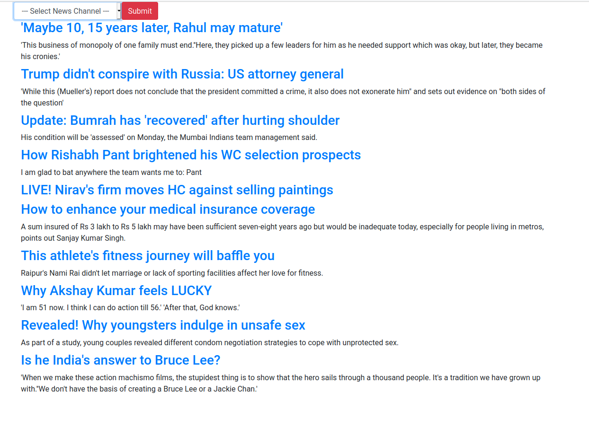

# <Project Name>

<table>
  <tr>
    <td>Image Caption</td>
  </tr>
  <tr>
    <td></td>
  </tr>
 </table>
<br/><hr><br/>

## About the project

<h3> From a list of news channel, grabs and displays news from their RSS feed </h3>

<br/><hr><br/>

## Stacks

- Python
- Flask
- Bootstrap

<br/><hr><br/>

## Features

```
1. flask hello world
2. working with form data
3. RSS feed
```

<br/><hr><br/>
